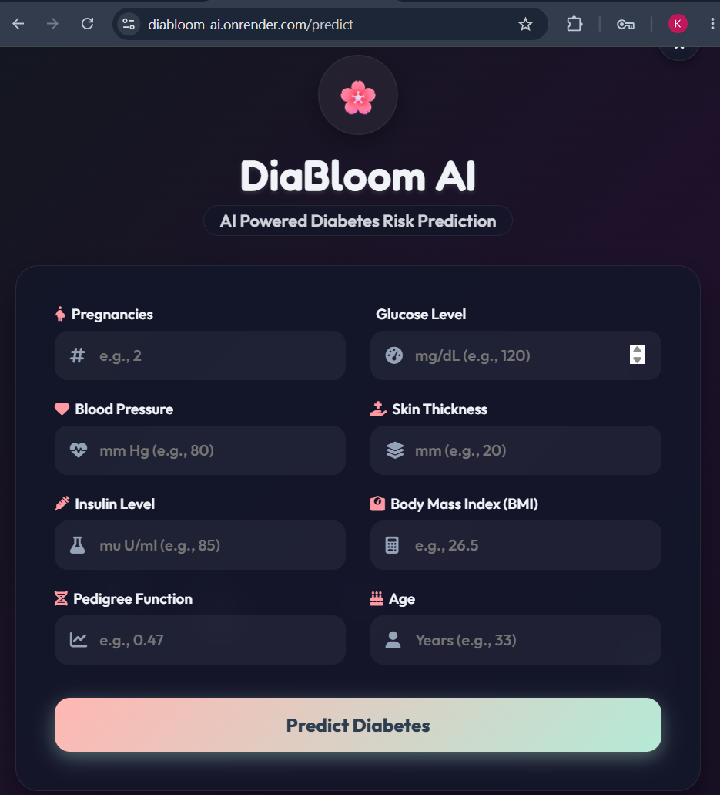
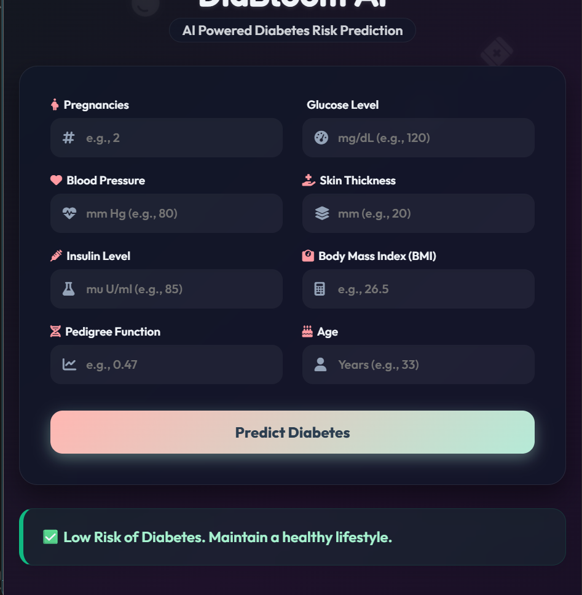

# DiaBloom AI

AI-powered Diabetes Risk Prediction Web Application built using Machine Learning, Flask, and Scikit-Learn.

## Live Demo

Live Application: https://diabloom-ai.onrender.com

## Application Preview





## Overview

DiaBloom AI is a machine learning-powered web application that predicts the likelihood of diabetes based on user-provided health parameters. The application combines a trained Scikit-Learn model with a Flask backend and an interactive frontend to provide real-time predictions through a user-friendly interface.

This project demonstrates the complete machine learning workflow, including data preprocessing, model training, backend integration, frontend development, version control, and cloud deployment.

## Features

* Diabetes risk prediction using Machine Learning
* Real-time prediction through Flask backend
* Modern and responsive user interface
* Mobile-friendly design
* Cloud deployment using Render
* End-to-end machine learning project implementation

## Technology Stack

### Backend

* Python
* Flask
* Scikit-Learn
* NumPy
* Pandas

### Frontend

* HTML
* CSS
* JavaScript

### Deployment & Version Control

* Git
* GitHub
* Render

## Dataset

The model was trained using the Pima Indians Diabetes Dataset, a widely used healthcare dataset for diabetes prediction.

### Input Features

* Pregnancies
* Glucose
* Blood Pressure
* Skin Thickness
* Insulin
* Body Mass Index (BMI)
* Diabetes Pedigree Function
* Age

## Project Structure

```text
DiaBloom-AI/
│
├── app.py
├── diabetes_model.sav
├── diabetes.csv
├── requirements.txt
│
├── templates/
│   └── index.html
│
├── home.png
├── result.png
│
└── README.md
```

## Installation and Setup

### Clone the Repository

```bash
git clone https://github.com/kashish836/DiaBloom-AI.git
cd DiaBloom-AI
```

### Install Dependencies

```bash
pip install -r requirements.txt
```

### Run the Application

```bash
python app.py
```

The application will be available locally at:

```text
http://127.0.0.1:5000
```

## Machine Learning Workflow

1. Data Collection and Exploration
2. Data Preprocessing
3. Model Training using Scikit-Learn
4. Model Serialization using Pickle
5. Flask Backend Integration
6. Frontend Development
7. Cloud Deployment using Render

## Future Enhancements

* Prediction probability score
* Interactive analytics dashboard
* Health recommendation system
* User authentication
* Prediction history tracking
* Advanced machine learning models
* Model performance comparison

## Learning Outcomes

Through this project, I gained practical experience in:

* Machine Learning Model Development
* Flask Web Development
* Frontend and Backend Integration
* Git and GitHub Workflow
* Cloud Deployment
* End-to-End Project Development

## Author

Kashish Bhiwapurkar

Aspiring Python Developer | AI Enthusiast 

## Connect

GitHub: https://github.com/kashish836

Project Repository: https://github.com/kashish836/DiaBloom-AI

Live Demo: https://diabloom-ai.onrender.com
